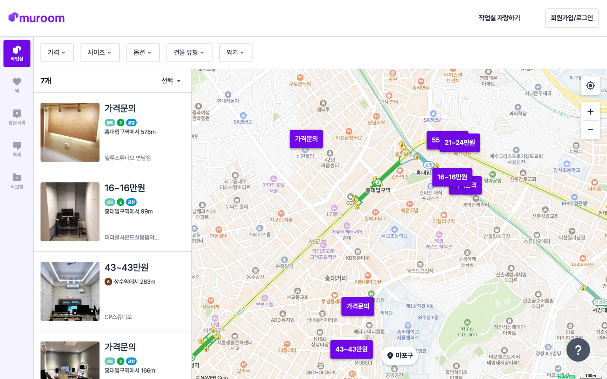
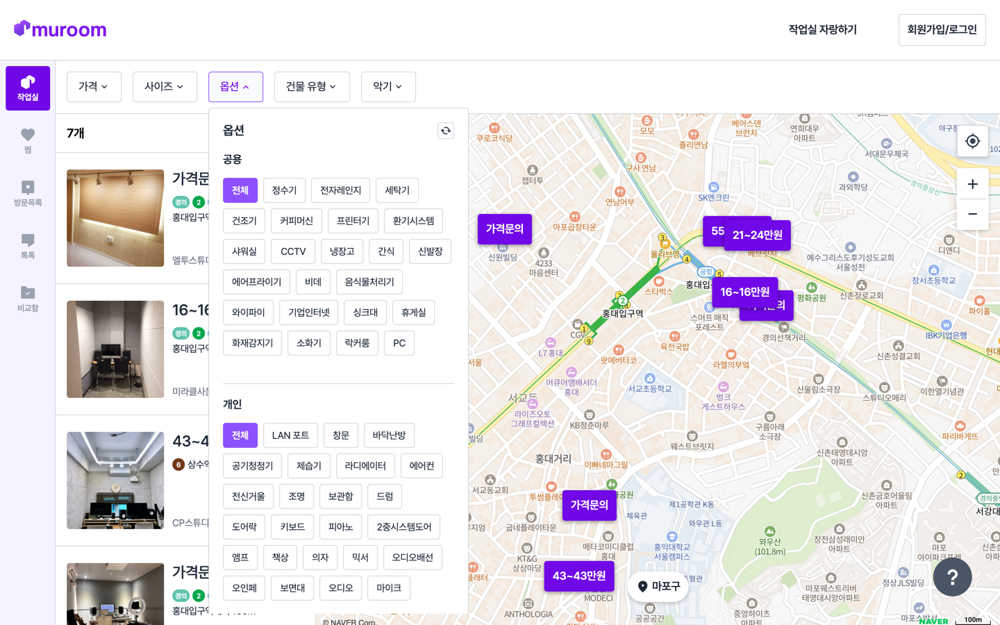
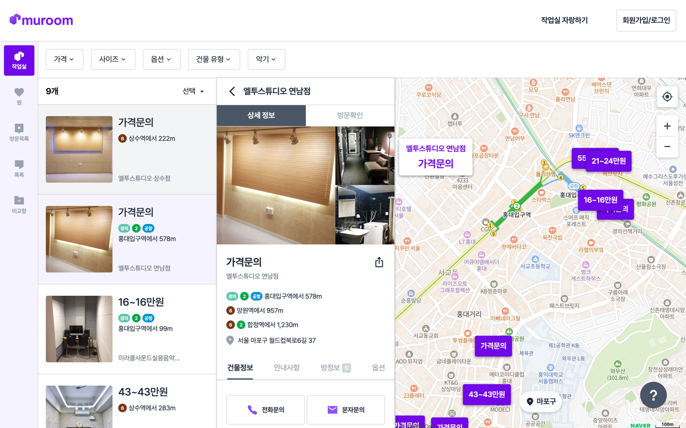
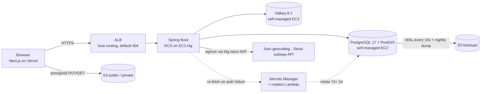

# Muroom (bach)

**Map-based search for music practice studios in Seoul — founded, built, and wound down in ten months.**

`● Wound down · Aug 2026` — this repository is preserved as a portfolio artifact. The full story lives in a nine-part write-up series ([start here](https://monte-kim.dev/writing/muroom-aws-on-pocket-money)).



Musicians pan a map; every studio inside the viewport appears as a price-tagged marker and a synced list card, filterable across **13 dimensions** — price, room size, floor type, parking, forbidden instruments, per-category amenities, and more. Each listing carries per-room pricing and straight-line distances to nearby subway stations. Supply was built by hand: **110 studio owners cold-called, 130 studios / 1,273 rooms catalogued.**

| Amenity filters (shared / per-room) | Studio detail |
|---|---|
|  |  |

## Engineering highlights

- **Geospatial search** — PostGIS `st_intersects` viewport queries injected via QueryDSL templates, composing with 13 optional filters in one builder; two-phase ID→entity pagination; sort whitelist. No spatial index — [measured, not forgotten](https://monte-kim.dev/writing/muroom-viewport-search).
- **Cost-constrained AWS, fully Terraformed** — prod + dev for ~$150/mo: NAT instance over NAT Gateway, self-managed Postgres/Valkey on Graviton EC2, one shared ALB with host routing. Compensated with 3-layer backups (DLM + nightly `pg_dump` + WAL shipped to S3 every 10s) and [RDS-grade credential rotation on a database AWS doesn't manage](https://monte-kim.dev/writing/muroom-credential-rotation) — zero-redeploy via the AWS Advanced JDBC Wrapper.
- **Sessions over JWT** — refresh-token state in Redis is sessions with extra steps, [so we deleted the JWT infrastructure](https://monte-kim.dev/writing/muroom-deleting-jwt); JWT survives only as short-lived handshake tokens.
- **App-side TSID primary keys** — time-sortable 64-bit IDs, zero INSERT round-trips — and [the day they stopped fitting in JavaScript](https://monte-kim.dev/writing/muroom-ids-javascript) (every API ID is a string now). FK-less studio domain: relax the database, enforce in code.
- **S3 policy engine** — bucket + prefix as an enum policy table, presigned browser-direct uploads, `temp/` promotion protocol with lifecycle-rule backstops. [Three rewrites, net −32 lines](https://monte-kim.dev/writing/muroom-file-storage-policy).

## Architecture



Single VPC, prod + dev separated by security groups and host headers. Operator access is SSM-only — no SSH keys exist. Everything is defined in [`infra/`](infra/) (Terraform).

## Stack

| | |
|---|---|
| **App** | Java 21 · Spring Boot 3.5 · Spring Security (session) · JPA/Hibernate + hibernate-spatial · QueryDSL 5 · OpenFeign |
| **Data** | PostgreSQL 17 · PostGIS · Flyway · Valkey · TSID · JSONB · proj4j (EPSG:5179→WGS84) |
| **Infra** | Terraform · EC2 (Graviton) · ECS · ALB · S3 · Secrets Manager + rotation Lambda · DLM · Docker |
| **Ops** | SSM Session Manager · actuator readiness gating · WAL→S3 near-PITR · calendar-versioned deploys |

## Team

Five people: two designers, one frontend developer, two on the backend. I ([@monte-kim](https://github.com/monte-kim), founder & registered CEO) owned the geospatial search, studio domain, file-storage engine, all schema migrations, and the entire AWS/Terraform footprint; [@2-say](https://github.com/2-say) built authentication (OAuth, sessions, SMS verification) and the member-facing domains. Frontend lives in [muroom-frontend-handel-web](https://github.com/muroom-studio/muroom-frontend-handel-web).

## Running locally

```bash
docker-compose up -d          # PostgreSQL 17 + PostGIS, Valkey (with ACL)
./gradlew bootRun --args='--spring.profiles.active=local'
```

Requires Java 21 and a handful of env vars (`JWT_SECRET_KEY`, external API keys — see `application-local.yml`); dummy values are enough to boot and browse. Flyway migrates the schema on startup. API docs at `/docs` (Swagger).

## The honest part

Eight real users. The [postmortem](https://monte-kim.dev/writing/muroom-130-studios-8-users) doesn't hide that — engineering quality is a multiplier, and demand is the number it multiplies. Known gaps are documented rather than scrubbed: admin endpoints shipped without role checks, a scheduler that never ran (`@EnableScheduling` was missing), and a content-type whitelist lost in a rewrite. They're part of the story.
